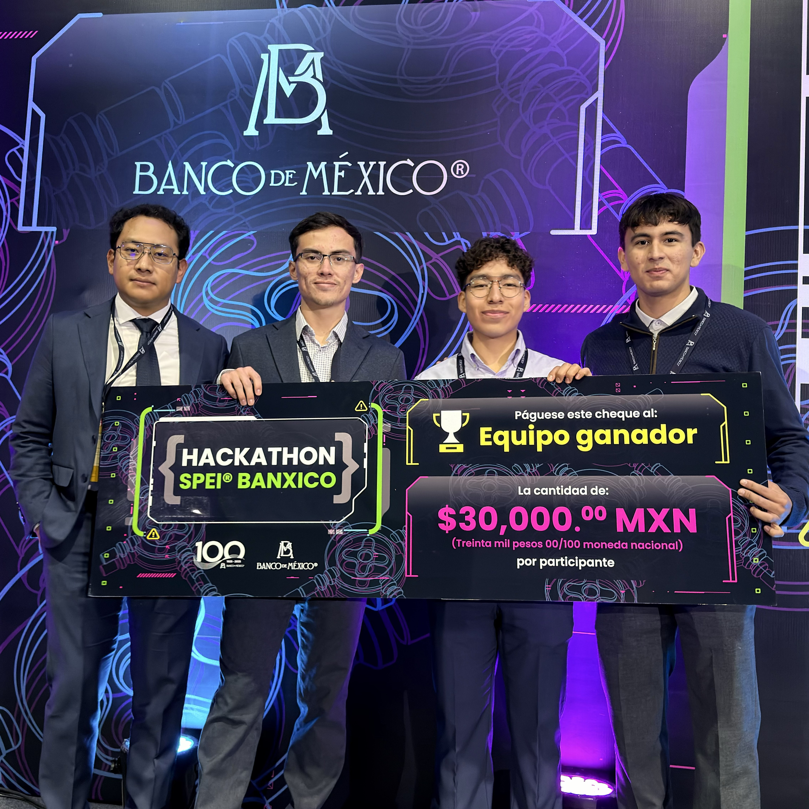

# Hackathon SPEI® Banxico 2025

Un recuerdo de nuestra participación y del reconocimiento como **equipo ganador de la Benemérita Universidad Autónoma de Puebla (BUAP)** en el Hackathon SPEI® Banxico 2025.

**[Visitar la página preservada →](https://ivanblueberry.github.io/HackBanxico/)**

## Por qué existe este repositorio

Soy Francisco Ivan Torres Flores y formé parte del equipo ganador de esta edición. Quise conservar la página donde Banco de México publicó nuestro resultado, junto con la fotografía del equipo y los nombres de quienes compartimos esta experiencia.

Los sitios de los eventos pueden cambiar o desaparecer con el tiempo. Este repositorio guarda una copia de esa página para mantener accesible el recuerdo de nuestra participación y poder compartirlo, incluso si el micrositio original deja de estar disponible.

## Nuestro equipo

Representamos a la **Benemérita Universidad Autónoma de Puebla**:

- Paul Sebastian Rosales Lamarque
- Francisco Ivan Torres Flores
- Carlos Manuel Ibarra Cervantes

Contamos con la asesoría de **Luis Enrique Morales Aguilar**.

## Qué puedes encontrar aquí

La página preservada reúne el anuncio del equipo ganador, las fotografías y los nombres de los equipos finalistas, las etapas y fechas del concurso, las preguntas frecuentes y las bases de participación de la edición 2025.

También se conservaron las imágenes y los recursos necesarios para mostrarla. Puedes recorrer el sitio o consultar directamente las **[bases de participación](d/HS2025_bases.pdf)**.

El contenido corresponde a una edición concluida: las fechas, las indicaciones de registro y las referencias a constancias se conservan como parte de su contexto histórico.

## Sobre esta copia

La fuente es el [micrositio del Hackathon SPEI® Banxico](https://www.banxico.org.mx/hackathonspei/), cuya captura se realizó el **21 de septiembre de 2026**, hora de Ciudad de México.

Se mantuvieron el contenido y el diseño de la página. Para su conservación se adaptó la codificación del HTML y se recuperaron las fuentes que ya no estaban disponibles en el servidor original. El HTML original y los registros de procedencia se guardan en la carpeta [archive](archive/).

Los enlaces a redes sociales y a otros sitios mantienen sus destinos originales y dependen de que esas páginas sigan disponibles.

## Créditos

Este es un archivo personal y no oficial. Los textos, fotografías, logotipos, marcas y diseño del micrositio pertenecen a sus respectivos titulares. Su conservación aquí tiene como propósito recordar y compartir esta experiencia; no implica afiliación ni representación de Banco de México.
